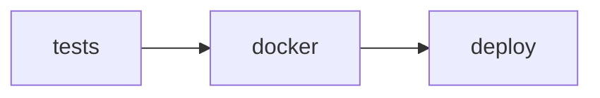

# CI/CD Pipeline Documentation

## Overview

The Learning Center project uses GitHub Actions for continuous integration and deployment, with Docker images stored in GitHub Container Registry (GHCR). The pipeline ensures code quality, builds production-ready containers, and enables automated deployments.

## Pipeline Architecture

### Workflow Triggers
- **Push to main**: Full CI/CD pipeline (tests + Docker build/push)
- **Pull requests**: Tests only
- **Git tags**: Full pipeline with tag-based image versioning

### Job Dependencies


## CI/CD Jobs

### Tests Job
**Purpose**: Validate code quality and functionality
**Runner**: `ubuntu-latest`

#### Steps:
1. **Checkout**: Repository code retrieval
2. **Setup PHP 8.3**: With required extensions (`pgsql`, `redis`)
3. **Cache Composer**: Dependency caching for faster builds
4. **Install Dependencies**: `composer install`
5. **Setup Node.js 20**: Frontend tooling
6. **Install Node Dependencies**: `npm ci`
7. **Build Assets**: `npm run build`
8. **Prepare Laravel**: Generate application key
9. **Run Tests**: `php artisan test`

#### Environment Variables:
```bash
APP_ENV=testing
CACHE_STORE=array
SESSION_DRIVER=array
```

### Docker Job
**Purpose**: Build and publish production Docker images
**Runner**: `ubuntu-latest`
**Condition**: Only on push events (not PRs)

#### Steps:
1. **Checkout**: Repository code retrieval
2. **GHCR Login**: Authenticate with GitHub Container Registry
3. **Docker Buildx**: Enable advanced build features
4. **Extract Metadata**: Generate image tags and labels
5. **Validate Dockerfile**: Ensure production Dockerfile exists
6. **Build & Push**: Create and upload Docker image
7. **Verify Image**: Test PHP extensions and functionality
8. **Record Information**: Log deployment details

#### Image Tags:
- `latest`: For main branch pushes
- `sha-<commit>`: For all pushes
- `<tag>`: For Git tag pushes

## Docker Build Process

### Enhanced Dockerfile Features
- **Base Image**: FrankenPHP with PHP 8.3
- **Required Extensions**: `intl`, `pcntl`, `pdo_pgsql`, `opcache`
- **Security**: Non-root user execution
- **Performance**: OPcache optimization
- **Multi-stage**: Optimized layer caching

### Build Arguments
```dockerfile
ARG APP_ENV=production
```

### Validation Checks
```bash
# PHP version verification
docker run --rm --entrypoint="" $IMAGE_TAG php --version

# Extension verification
docker run --rm --entrypoint="" $IMAGE_TAG php -m | grep -E "(intl|pcntl|pdo_pgsql|opcache)"
```

## GitHub Container Registry (GHCR)

### Authentication
- **CI/CD**: Uses `GITHUB_TOKEN` (automatic)
- **Local**: Requires personal access token

### Image Naming Convention
```
ghcr.io/hafizhfadh/learningcenter:<tag>
```

### Available Tags
- `latest`: Most recent main branch build
- `sha-<commit>`: Specific commit builds
- `v<version>`: Release versions

## Local Testing

### GHCR Upload Test Script
```bash
# Test the complete GHCR upload process
./test-ghcr-upload.sh

# Set repository for testing
export GITHUB_REPOSITORY="hafizhfadh/learningcenter"
./test-ghcr-upload.sh
```

#### Script Features:
- Docker build validation
- GHCR authentication check
- Image push simulation
- Automatic cleanup
- Comprehensive reporting

### Manual Docker Testing
```bash
# Build production image locally
docker build -f deploy/production/Dockerfile -t learningcenter:test .

# Test PHP extensions
docker run --rm --entrypoint="" learningcenter:test php -m

# Test application startup
docker run --rm -p 8080:8080 learningcenter:test
```

## Production Deployment

### Automated Deployment
1. **CI/CD Trigger**: Push to main branch
2. **Image Build**: Automated Docker build and push
3. **Image Verification**: PHP extension and functionality checks
4. **GHCR Upload**: Tagged image storage

### Manual Deployment
```bash
# Deploy latest image
./deploy/production/bin/deploy.sh

# Deploy specific version
APP_IMAGE=ghcr.io/hafizhfadh/learningcenter:v1.2.3 ./deploy/production/bin/deploy.sh
```

### Deployment Script Features
- **Image Pulling**: Automatic GHCR image retrieval
- **Health Checks**: Container readiness validation
- **PHP Verification**: Extension availability checks
- **Zero Downtime**: Rolling updates with health monitoring
- **Logging**: Comprehensive deployment logs

## Environment Configuration

### Required Secrets (GitHub Actions)
- `GITHUB_TOKEN`: Automatic (for GHCR access)

### Environment Variables
```bash
# CI/CD Pipeline
IMAGE_REGISTRY=ghcr.io
IMAGE_NAME=ghcr.io/hafizhfadh/learningcenter

# Production Deployment
APP_IMAGE=ghcr.io/hafizhfadh/learningcenter:latest
HEALTH_TIMEOUT_SECONDS=180
RUN_MIGRATIONS=1
```

### Local Development
```bash
# GHCR Testing
GITHUB_REPOSITORY=hafizhfadh/learningcenter
GITHUB_TOKEN=<your-token>  # For local GHCR testing
```

## Monitoring & Troubleshooting

### CI/CD Monitoring
- **GitHub Actions**: View workflow runs and logs
- **GHCR**: Monitor image uploads and storage
- **Build Times**: Track performance metrics

### Common Issues

#### Build Failures
```bash
# Check Dockerfile syntax
docker build -f deploy/production/Dockerfile .

# Verify base image availability
docker pull dunglas/frankenphp:php8.3
```

#### GHCR Authentication
```bash
# Test GHCR connectivity
docker pull ghcr.io/hafizhfadh/learningcenter:latest

# Check authentication
docker login ghcr.io
```

#### PHP Extension Issues
```bash
# Verify extensions in built image
docker run --rm --entrypoint="" <image> php -m | grep -E "(intl|pcntl|pdo_pgsql|opcache)"

# Check Dockerfile extension installation
grep -A 10 "RUN apk add" deploy/production/Dockerfile
```

### Debugging Commands
```bash
# View CI/CD logs
gh run list --repo hafizhfadh/learningcenter
gh run view <run-id> --repo hafizhfadh/learningcenter

# Check deployment logs
tail -f deploy/production/logs/deploy-*.log

# Verify deployed image
docker compose --env-file deploy/production/secrets/.env.production \
  -f deploy/production/docker-compose.yml exec app php -v
```

## Performance Optimization

### Build Optimization
- **Layer Caching**: GitHub Actions cache for Docker layers
- **Multi-stage Builds**: Minimize final image size
- **Dependency Caching**: Composer and npm cache reuse

### Deployment Optimization
- **Health Checks**: Fast container readiness detection
- **Rolling Updates**: Zero-downtime deployments
- **Image Reuse**: Efficient image layer sharing

## Security Considerations

### Container Security
- **Non-root User**: Application runs as non-privileged user
- **Minimal Base**: FrankenPHP with only required components
- **Read-only Filesystem**: Where applicable

### Registry Security
- **Private Registry**: GHCR with authentication required
- **Token Management**: Secure GitHub token handling
- **Image Scanning**: Automated vulnerability detection

### Deployment Security
- **Secret Management**: Environment-based secret injection
- **TLS Encryption**: All external communications encrypted
- **Access Control**: Limited deployment script permissions

## Maintenance

### Regular Tasks
- **Image Cleanup**: Remove old GHCR images periodically
- **Log Rotation**: Manage deployment log files
- **Security Updates**: Keep base images updated

### Version Management
- **Semantic Versioning**: Use Git tags for releases
- **Image Tagging**: Consistent tag naming convention
- **Rollback Strategy**: Previous image availability

### Documentation Updates
- **Pipeline Changes**: Update this document for workflow modifications
- **New Features**: Document new CI/CD capabilities
- **Troubleshooting**: Add new common issues and solutions